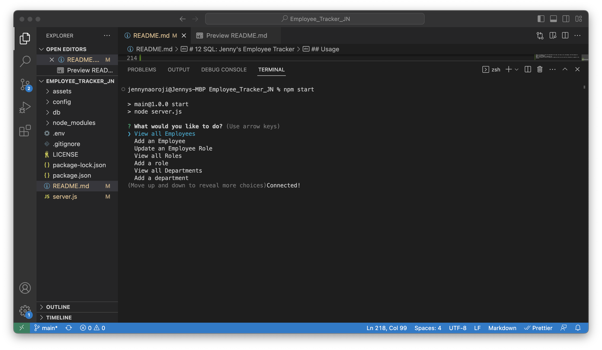

# 12 SQL: Jenny's Employee Tracker

## Description

My Task is to create an interface that allows non-developers to easily view and interact with information stored in mybusiness database. This will be a command-line application to manage a company's employee database, built using Node.js, Inquirer, and MySQL.

This Cli application will help a business owner to be able to view and manage the departments, roles, and employees in their company so they can keep organised.
The Cli will accept user input and the user will be able to view all departments, view all roles, view all employees, add a department, add a role, add an employee, and update an employee role.

## Usage

Use the Command-line-interface to follow the prompts and enter or update data about your business. 
You can also view the application on this walkthrough video link:
https://youtu.be/7LJtOEhiQ-k 

## Screenshot

The following screenshots show my web application's appearance and functionality:

Command line application:

## Credits

* [Fullstack Blog Video Submission Guide](https://coding-boot-camp.github.io/full-stack/computer-literacy/video-submission-guide).
* [MySQL2 package](https://www.npmjs.com/package/mysql2)
* [Inquirer package](https://www.npmjs.com/package/inquirer/v/8.2.4)
* [npm documentation on MySQL2](https://www.npmjs.com/package/mysql2)
* Example video:

* Database schema example: 

* Schema example:

* `department`

    * `id`: `INT PRIMARY KEY`

    * `name`: `VARCHAR(30)` to hold department name

* `role`

    * `id`: `INT PRIMARY KEY`

    * `title`: `VARCHAR(30)` to hold role title

    * `salary`: `DECIMAL` to hold role salary

    * `department_id`: `INT` to hold reference to department role belongs to

* `employee`

    * `id`: `INT PRIMARY KEY`

    * `first_name`: `VARCHAR(30)` to hold employee first name

    * `last_name`: `VARCHAR(30)` to hold employee last name

    * `role_id`: `INT` to hold reference to employee role

    * `manager_id`: `INT` to hold reference to another employee that is the manager of the current employee (`null` if the employee has no manager)

## License

Please refer to the LICENSE in the repo or click on the badge for documentation.

